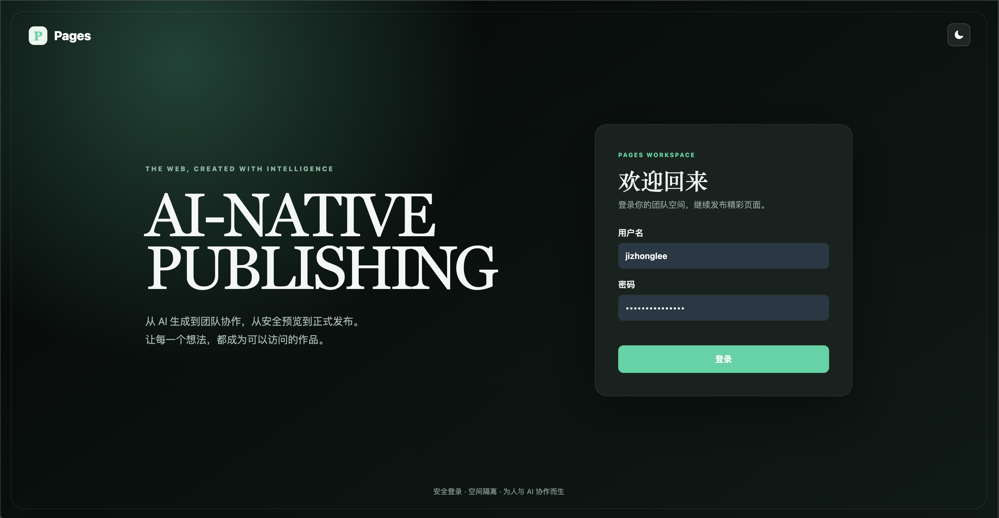
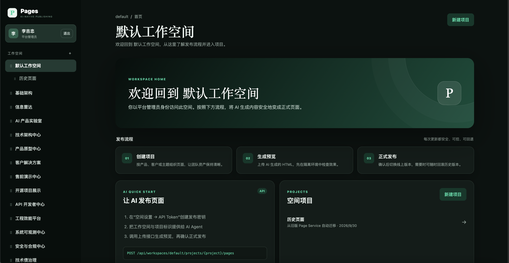

<p align="center"></p>

<h1 align="center">Pages</h1>

<p align="center">
  <strong>A lightweight, AI-native publishing workspace for teams and agents.</strong><br />
  Turn generated HTML into reviewable previews, controlled releases, and durable public pages.
</p>

<p align="center">
  
  
  
  
</p>

<p align="center">
  <a href="#quick-start">Quick Start</a> •
  <a href="#features">Features</a> •
  <a href="#api-quickstart">API</a> •
  <a href="#docker-deployment">Docker</a> •
  <a href="#security-model">Security</a>
</p>

Pages is a compact publishing service for teams that create web content with AI. It provides a browser workspace for people and a clean HTTP API for agents, while keeping every workspace, project, preview, release, and historical version under explicit control.

Instead of copying generated HTML directly to production, Pages introduces a simple release workflow:

```text
Create a project → Upload HTML → Review an isolated preview → Publish → Roll back when needed
```

## Product Tour

### Secure workspace sign-in



### Workspace and project management



## Features

- **Workspace isolation** — separate teams, projects, members, API credentials, and published content.
- **Project-based organization** — group related pages under stable workspace and project identifiers.
- **Human and agent access** — use the browser interface for editorial work or the HTTP API for automation.
- **Preview-first publishing** — every upload creates an isolated preview without changing the live page.
- **Controlled releases** — explicitly promote a selected version after review.
- **Complete version history** — inspect prior versions and switch the published version to roll back.
- **Role-based access control** — assign owner, administrator, editor, or viewer access per workspace.
- **Scoped API tokens** — issue workspace credentials with `read`, `write`, and `admin` permissions.
- **Secure browser sessions** — HttpOnly cookies, CSRF protection, and PBKDF2 password hashing.
- **Protected credentials** — workspace token secrets are shown once; only SHA-256 hashes are stored.
- **Flexible HTML ingestion** — upload with multipart forms, JSON payloads, or raw HTML requests.
- **Safe content separation** — uploaded pages run under a restrictive CSP sandbox, isolated from the admin UI.
- **Reliable local persistence** — page files and metadata use local storage with atomic index writes.
- **Legacy compatibility** — existing pages are migrated automatically and old `/p/{slug}` links continue to work.
- **Small operational footprint** — a single Go binary with no external database requirement.

## How It Works

Pages separates authoring from publishing. An upload is stored as a new immutable version and receives a preview URL. The public URL changes only after that version is explicitly published.

```text
AI agent or browser
        │
        ▼
  Workspace API
        │
        ├── Project metadata
        ├── Versioned HTML files
        └── Preview URL
                │
                ▼
        Review and approval
                │
                ▼
         Stable public URL
```

The default storage layout is intentionally easy to inspect and back up:

```text
data/
├── state.json
└── workspaces/
    └── {workspace}/projects/{project}/pages/{slug}/versions/{version}.html
```

## Quick Start

Requirements:

- Go 1.23 or later
- A modern browser

Start the service with an explicit platform token:

```bash
PAGE_TOKEN='replace-with-a-long-random-secret' go run .
```

Open [http://localhost:8080](http://localhost:8080). On first launch, Pages guides you through creating the initial platform administrator. Existing workspaces are automatically assigned to that administrator.

> `PAGE_TOKEN=dev-token` is suitable only for local evaluation. Always set a strong, unique secret in production.

### Configuration

| Environment variable | Default | Description |
|---|---:|---|
| `PAGE_TOKEN` | `dev-token` | Platform-level token for automation and emergency administration |
| `PAGE_ADDR` | `:8080` | HTTP listen address |
| `PAGE_DATA` | `./data` | Metadata and page storage directory |

## API Quickstart

The examples below use the platform token. Workspace tokens should be preferred for day-to-day agent workflows because their access is isolated to one workspace.

### Create a workspace and project

```bash
curl -X POST http://localhost:8080/api/workspaces \
  -H "Authorization: Bearer $PAGE_TOKEN" \
  -H "Content-Type: application/json" \
  -d '{"slug":"acme","name":"Acme Team"}'

curl -X POST http://localhost:8080/api/workspaces/acme/projects \
  -H "Authorization: Bearer $PAGE_TOKEN" \
  -H "Content-Type: application/json" \
  -d '{"slug":"website","name":"Brand Website"}'
```

### Create a workspace token

```bash
curl -X POST http://localhost:8080/api/workspaces/acme/tokens \
  -H "Authorization: Bearer $PAGE_TOKEN" \
  -H "Content-Type: application/json" \
  -d '{"name":"AI Publisher","scopes":["read","write"]}'
```

The response contains a `secret` value exactly once. Store it securely and use it as `WORKSPACE_TOKEN` for subsequent publishing requests.

### Upload a preview

```bash
curl -X POST http://localhost:8080/api/workspaces/acme/projects/website/pages \
  -H "Authorization: Bearer $WORKSPACE_TOKEN" \
  -F "slug=home" \
  -F "title=Home" \
  -F "file=@./index.html"
```

JSON uploads are also supported:

```bash
curl -X POST http://localhost:8080/api/workspaces/acme/projects/website/pages \
  -H "Authorization: Bearer $WORKSPACE_TOKEN" \
  -H "Content-Type: application/json" \
  -d '{"slug":"hello","title":"Hello","html":"<!doctype html><h1>Hello</h1>"}'
```

The upload response includes `latestVersion` and `latestPreviewUrl`. Review the preview, then publish that exact version:

```bash
curl -X POST http://localhost:8080/api/workspaces/acme/projects/website/pages/home/publish \
  -H "Authorization: Bearer $WORKSPACE_TOKEN" \
  -H "Content-Type: application/json" \
  -d '{"version":"ver_xxx"}'
```

### Page URLs

```text
# Stable published page
GET /p/{workspace}/{project}/{slug}

# Version history
GET /api/workspaces/{workspace}/projects/{project}/pages/{slug}/versions
```

Uploading a new version never changes the stable public URL until the publish endpoint is called.

## Access Control

### Platform roles

| Role | Permissions |
|---|---|
| Platform administrator | Manage users, all workspaces, and platform configuration |
| Member | Access only explicitly assigned workspaces |

### Workspace roles

| Role | Permissions |
|---|---|
| Owner | Manage members, projects, pages, and API tokens |
| Administrator | Manage members, projects, pages, and API tokens |
| Editor | View projects and upload, publish, replace, or delete pages |
| Viewer | View projects and page listings |

### API token scopes

| Scope | Permissions |
|---|---|
| `read` | Read the assigned workspace, projects, pages, and versions |
| `write` | Upload, replace, publish, and delete pages |
| `admin` | Manage projects and workspace tokens; includes read and write access |

Only the platform administrator token can create or delete workspaces.

## Docker Deployment

Create a `.env` file:

```dotenv
PAGE_TOKEN=replace-with-a-long-random-secret
```

Build and start the service:

```bash
docker compose up -d --build
```

The Compose configuration mounts `./data` at `/app/data`, so metadata, previews, published pages, and version history survive container replacement.

Check service health:

```bash
curl http://localhost:8080/healthz
```

## Security Model

Pages treats uploaded HTML as untrusted content.

- Uploaded pages are served separately from the management application.
- A restrictive Content Security Policy sandbox limits page capabilities.
- Browser authentication uses HttpOnly, SameSite session cookies.
- State-changing browser requests require CSRF validation.
- Passwords are derived with PBKDF2 and unique salts.
- API token plaintext is never persisted.
- Workspace tokens limit the blast radius of leaked automation credentials.
- Slugs are strictly validated to prevent path traversal.
- Each HTML upload is limited to 5 MB.

For production use, place Pages behind a TLS-terminating reverse proxy, protect the data directory with regular backups, rotate credentials, and grant every agent only the minimum required scope.

## Legacy Data Migration

On the first launch of the workspace-aware version, content from `data/index.json` and `data/pages` is copied into `default/legacy`. Original files are retained and legacy `/p/{slug}` URLs remain available.

## Development

Run the test and static analysis suites:

```bash
go test ./...
go vet ./...
```

Build a local binary:

```bash
go build -o page-service .
```

## Current Scope

Pages currently focuses on publishing self-contained HTML documents. Its release model already supports preview, approval, publication, history, and rollback. Multi-file sites, richer deployment policies, automated validation, and approval workflows are natural future extensions.

## Project Philosophy

AI makes producing interfaces dramatically faster. Publishing those interfaces still requires ownership, review, permissions, traceability, and a stable destination. Pages provides that missing operational layer without introducing a large infrastructure stack.
